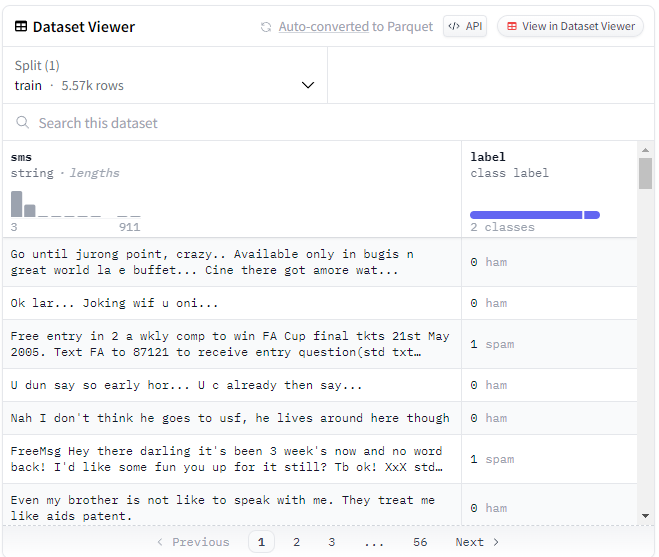
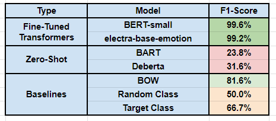
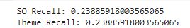

# Report

## Dataset
This dataset was pulled from [Huggingface.com](https://huggingface.co/datasets/sms_spam) and is composed of ~5,500 rows of text messages. These text messages are labelled as being either "spam" or "ham".
* **Spam:** Irrelevant/inappropriate messages sent on the internet to a large number of recipients.
* **Ham:** The opposite of spam -- relevant/personal messages sent from another individual.

The dataset was eventually split into a training and testing set with a roughly 80-20 division:
* 4,000 training parameters
* ~1,500 testing parameters

Here, **F1 Score** for spam messages is important. We are not really interested in the real messages, but just being able to determine which messages are actually spam or incorrectly classified as real from the spam messages. 

## Fine-Tuned Models
The pre-trained transformer models selected included: 
* [**BERT-small**](https://huggingface.co/prajjwal1/bert-small)
  * A smaller pre-trained BERT variant
  * ~111M parameters
  * 12 encoders with 12 bidirectional self-attention heads
    
* [**ELECTRA-base-emotion**](https://huggingface.co/bhadresh-savani/electra-base-emotion)
  * A specific model of electra used with an emotion dataset
  * ~128M parameters
  * BERT is underlying model

My dataset needed to be tokenized according to the models already set up tokenization, split into training and testing, and applied to an AutoSequence Classifier. It was then applied to a trainer and eventually ran on the testing dataset to compute the desired F1 Scores.

## Zero-Shot Classification
For zero-shot classification I utilized two zero-shot models also found on Huggingface.

* [**BART**](https://huggingface.co/docs/transformers/en/model_doc/bart)
  * BART Large trained on the MNLI dataset
  * 407M parameters
    
* [**DeBERTa-v3**](https://huggingface.co/sileod/deberta-v3-base-tasksource-nli)
  * DeBERTa-v3-base fine-tuned with multi-task learning on 600+ tasks
  * 180.4M parameters
  * Nvidia A30 24GB gpu for training

 I created four prompts hoping to get responses with the first options being a spam message and the second being a ham message:

 * **Prompt 1:**: "Is this message spam or ham (non-spam)? [MESSAGE]."
 * **Prompt 2:** Classify the following text message into spam or ham (non-spam): [MESSAGE]."
 * **Prompt 3:** Please classify the following message as either spam or ham (non-spam): [MESSAGE]."
 * **Prompt 4:** Spam is automated and unnecessary, ham(the opposite) is from a real person. Please classify the following text message as being spam or ham(not spam): [MESSAGE]."

Of these prompts, prompt 1 performed the best with the DeBERT model and prompt 2 worked the best with the BART model (although neither overall performed that well).

## Baselines
I created three baselines that are very reproducible:
* **BOW** which utilized a TFIDF approach and a logistic regression.
* **Random Class** which generated 10,000 random predictions to the 10,000 actual results.
* **Target Class** Assumed every text was our target -- a spam text.

For the Random and Target Class, I generated 10,000 values as the actual values and compared them to 10,000 generated predictions and 10,000 spam labels accordingly.

## Results

Obviously, the pre-trained fine-tuned transformer models by far predict the spam messages the best with nearly a 100% f1-score. The baseline logistic regression model demonstrates that this shouldn't be a difficult task at all with an ability to predict an f1-score of ~81.6%. At the same time, the zero-shot classification seems off. These values are disgustingly low, and although they don't have bad accuracy (Bart ~70%), the metric we are concerned with in F1-score doesn't perform well at all. In fact, both zero-shot models do a horrible job even compared to the random baseline model. This means we could almost select randomly and do a better job. What I happened here is that I selected zero-shot models from Huggingface that weren't specifically trained for classification tasks. The Bart model I chose was trained on the MNLI dataset and the Selectra was trained on a portion of the XLNI dataset. This is a problem because obviously I wanted to do a classification task. 

With this mistake in mind, I actually found two classification-trained zero-shot models (not included in code, picture added): 
* [Stack Overflow Zero Shot Classification](https://huggingface.co/amaye15/Stack-Overflow-Zero-Shot-Classification)
* [Theme Classification](https://huggingface.co/eleldar/theme-classification)

These two datasets takes advantage of DeBERTa's zero-shot classification, but even then apparently were trained on MLNI tasks. I struggled to find zero-shot models on the zero-shot classification section of Huggingface that weren't trained for MLNI. The results were also poor (and the same? They must have been trained from the same dataset):

## Reflection

During the completion of this assignment, I was able to use the transformers package in Python. Although the concept is still a little fuzzy and I had to use a lot of documentation help, I think it is very interesting to see that all of these models have their own tokenizer objects because they classify tokens in different ways. Additionally, I didn't know that this level of NLP power was just open-source on the internet for people like me to use. 

When doing this project some challenges faced included utilizing these models in terms of computation and size. I ended up just selecting smaller models with limited parameters and switched my Colab runtime to process some things on their free-tier GPU (which sped things up SIGNIFICANTLY). Other than that I struggled with the prompt engineering, but mainly because the models weren't performing well no matter what prompt I chose -- I think maybe I was doing this step of the assignment incorrectly as I was using MLNI models typically used for sentence generation to classify a label? It could also have been possible that the zero-shot heavily favored the token "spam" as opposed to "ham(non-spam)" due to the complexity of the tokens. I don't think me explaining that ham is "not spam" helped in the prompts, but perhaps if I went back and changed the classifier labels it would make some difference (although I doubt "ham" is a likely probability for being the following token anyways). I also had problems getting some of the models to work in colab as they were clashing with numpy. I eventually found models and documentation to get this to work. 
