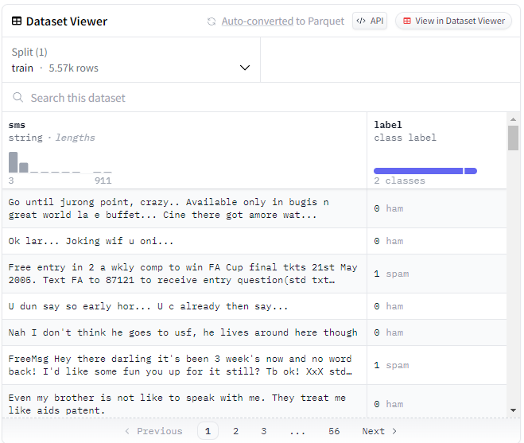
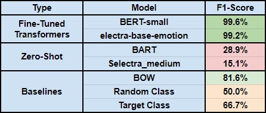

# Report

## Dataset
This dataset was pulled from [Huggingface.com](https://huggingface.co/datasets/sms_spam) and is composed of ~5,500 rows of text messages. These text messages are labelled as being either "spam" or "ham".
* **Spam:** Irrelevant/inappropriate messages sent on the internet to a large number of recipients.
* **Ham:** The opposite of spam -- relevant/personal messages sent from another individual.

The dataset was eventually split into a training and testing set with a roughly 80-20 division:
* 4,000 training parameters
* ~1,500 testing parameters

Here, **F1 Score** for spam messages is important. We are not really interested in the real messages, but just being able to determine which messages are actually spam or incorrectly classified as real from the spam messages. 

## Fine-Tuned Models
The pre-trained transformer models selected included: 
* [**BERT-small**](https://huggingface.co/prajjwal1/bert-small)
  * A smaller pre-trained BERT variant
  * ~111M parameters
  * 12 encoders with 12 bidirectional self-attention heads
    
* [**ELECTRA-base-emotion**](https://huggingface.co/bhadresh-savani/electra-base-emotion)
  * A specific model of electra used with an emotion dataset
  * ~128M parameters
  * BERT is underlying model

My dataset needed to be tokenized according to the models already set up tokenization, split into training and testing, and applied to an AutoSequence Classifier. It was then applied to a trainer and eventually ran on the testing dataset to compute the desired F1 Scores.

## Zero-Shot Classification
For zero-shot classification I utilized two zero-shot models that were fine-tuned on something outside of my own dataset.

* [**BART**](https://huggingface.co/docs/transformers/en/model_doc/bart)
  * BART Large trained on the MNLI dataset
  * 407M parameters
    
* [**Selectra**](https://huggingface.co/Recognai/zeroshot_selectra_medium)
  * Selectra model fine-tuned on Spanish portion of XNLI dataset
  * 40.8M parameters

 I created four prompts hoping to get responses with the first options being a spam message and the second being a ham message:

 * **Prompt 1:**: "Is this message spam or ham (non-spam)? [MESSAGE]."
 * **Prompt 2:** Classify the following text message into spam or ham (non-spam): [MESSAGE]."
 * **Prompt 3:** Please classify the following message as either spam or ham (non-spam): [MESSAGE]."
 * **Prompt 4:** Spam is automated and unnecessary, ham(the opposite) is from a real person. Please classify the following text message as being spam or ham(not spam): [MESSAGE]."

Of these prompts, only the fourth was able to correctly identify the test message as spam for the spam message and ham for the ham message for both models. I had originally tried putting the answers in a bracket format or putting them in front of the prompt, but I found that when additional information about the classification labels was provided along with a specific type of question prompt being asked, the classification was better.

## Baselines
I created three baselines that are very reproducible:
* **BOW** which utilized a TFIDF approach and a logistic regression.
* **Random Class** which generated 10,000 random predictions to the 10,000 actual results.
* **Target Class** Assumed every text was our target -- a spam text.

For the Random and Target Class, I generated 10,000 values as the actual values and compared them to 10,000 generated predictions and 10,000 spam labels accordingly.

## Results

Obviously, the pre-trained fine-tuned transformer models by far predict the spam messages the best with nearly a 100% f1-score. The baseline logistic regression model demonstrates that this shouldn't be a difficult task at all with an ability to predict an f1-score of ~81.6%. At the same time, the zero-shot classification seems off. These values are disgustingly low, and although they don't have bad accuracy (Bart ~70%), the metric we are concerned with in F1-score doesn't perform well at all. In fact, both zero-shot models do a horrible job even compared to the random baseline model. This means we could almost select randomly and do a better job. I am not sure if this is a user error or do to the fact that we had to use models fine-tuned and trained for different tasks (like spanish classification in this case), but it is alarming how poorly the zero-shot models performed. 

## Reflection
During the completion of this assignment, I was able to use the transformers package in Python. Although the concept is still a little fuzzy and I had to use a lot of documentation help, I think it is very interesting to see that all of these models have their own tokenizer objects because they classify tokens in different ways. Additionally, I didn't know that this level of NLP power was just open-source on the internet for people like me to use. 

When doing this project some challenges faced included utilizing these models in terms of computation and size. I ended up just selecting smaller models with limited parameters and switched my Colab runtime to process some things on their free-tier GPU (which sped things up SIGNIFICANTLY). Other than that I struggled with the prompt engineering, but mainly because the models weren't performing well no matter what prompt I chose and because the models I selected weren't specific for classification or question/answering tasks. This was because I tried importing specific models but kept receiving an error for which no documentation I looked at helped. 
